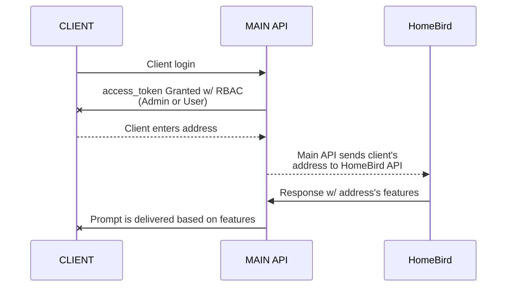

# API Development

#### *ToC*
[DoD](#dod)<br>
[Relevant Links](#relevant-links)<br>
[Features](#features)<br>
[UX](#ux)<br>
[API Overview](#api-overview)<br> 
[Usage and Testing Instructions](#usage-and-testing-instructions)<br> 
[Endpoints](#endpoints)<br>
[Next Steps](#next-steps)<br>  


<a name="dod"></a>
## DoD
A feature-detection API to provide specific information regarding a client's house for prompting purposes. 

* E.g., "We detect your home's **sewer system** is a **septic tank**. Do you have up-to-date insurance for the septic system?"

The source of the house features is a third-party API (HomeBird) which *must be abstracted behind the intermediary Main API* and should allow for swapping out the current third-party API for another potentially. 

> *To quickly review the PM's requested feature for a single user, please jump down to the <a href="#user">user</a> user story, and move through to Point 5.*

<a name="relevant-links"></a>
## Relevant Links

**Main Product**
* [Main API Repository](https://github.com/rscheiwe/genesis-homes) - *local dev and deployment instructions in README*
* [Deployed Swagger Docs](https://genesis-homes.herokuapp.com/docs)
* [Deployed URL](https://genesis-homes.herokuapp.com/)

**Bootstrapped Data API** (aka, third-party vendor)
* [Bootstrapped Data API Repository](https://github.com/rscheiwe/homebird) (*HomeBird*, a HouseCanary mock)
* [Deployed Swagger Docs](https://homebird.herokuapp.com/docs)
* [Deployed URL for Bootstrapped Data API](https://homebird.herokuapp.com/)

<sub>
<em>
<b>
Note: The bootstrapped data API is tangential to the main product but necessary to provide a robust user experience. 
</b>
</em>
</sub>

<a name="features"></a>
## Features

* Interchangeability with other third-party APIs (e.g., Zillow)
* Role-based Access Control (RBAC) for "ADMIN" and "USER" roles
* Authentication and protected routes to ensure user-specific data
* Task queuing and message brokering via Celery

<a name="relevant-links"></a>
## UX

Hypothetical End-to-End Flow:

1. The user authenticates
2. The user enters her addresss in the relevant form on the frontend
3. The form sends the address to Main API endpoint `/genesis-properties/user-property-details-external`
4. The endpoint calls the third-party API (HomeBird API) to run the address against the available data
5. HomeBird API sends response to Main API with house details, specifically Sewer System
6. Main API sends response to frontend
7. Given the response from HomeBird API, the frontend may prompt the user based on info provided by HomeBird API

<a name="api-overview"></a>
## API Overview

`/genesis-properties/user-property-details-external` abstracts the logic that calls the third-party API (HomeBird) for house details, namely the sewer system detail.

> Sewer system-detection flow for a single user via `/genesis-properties/user-property-details-external`



<a name="usage-and-testing-instructions"></a>
## Usage and Testing Instructions

### Two user stories are available:
*	[Admin](#admin) 
	*	`username`: `admin`
*	[User](#user) 
	*	`username`:`alice`
	*	`username`:`john`
	*	`username`:`sarah`
	*	`username`:`geri`
	*	`username`:`kevin`
	
<a name="admin"></a>
#### Admin

1. Authenticate via lock icon in [Swagger](https://genesis-homes.herokuapp.com/docs)
	- `username`: **`admin`**
	- `password`: **`string`** (the word "string")
2. Now, all endpoints are accessible to try out
3. Try out: `/users`
	- Open the  `/genesis-users/users` accordion
	- Click "Try It Out"
	- Then click "Execute" (no params necessary)
	- The response contains all stored users and their respective property addresses
4. Try out: `/property-details-external` (third-party API calls via Main API)
	- Open the `/genesis-properties/property-details-external` accordion
	- Click "Try It Out"
	- Note: This endpoint has conditions to alter the response:
		- `external_source`: Specific third-part API to leverage (note, only HouseCanary, aka HomeBird, is wired)  
		- `verbosity`: Specify whether all details (`verbose`) should be returned or just sewer system-related details (`sewer_system`)
		- `property_selection`: Return `all` properties and respective details or a specific address
	- Then click "Execute"
	- The response contains the specified level of details for the specified properties

<a name="user"></a>
#### User

1. Authenticate via lock icon in [Swagger](https://genesis-homes.herokuapp.com/docs)
	- `username`: **`alice`**
	- `password`: **`string`** (the word "string")
	- Note: Any username specified above works with the password `string`. *Each user is assigned their own property*.
	- Note 2: `kevin` represents the 'unhappy path' when a user's address is not found at the external API
2. Now, only endpoints ***scoped to authenticated user*** are accessible
3. Try out: `/users`
	- Open the  `/genesis-users/users` accordion
	- Click "Try It Out"
	- Then click "Execute" (no params necessary)
	- Note the response:
```
{
  "detail": "Operation not permitted: Your role of USER does not have sufficient permissions."
}
```
4. Try out: `/current-user`
	- Open the  `/genesis-users/current-user` accordion
	- Click "Try It Out"
	- Then click "Execute" (no params necessary)
	-  The response contains the *currently authenticated* user's info
5. Try out: `/user-property-details-external` 🔴 **DoD** 🔴
	- Open the  `/genesis-properties/user-property-details-external` accordion
	- Click "Try It Out"
	- Note: This endpoint has conditions to alter the response:
		- `external_source`: Specific third-part API to leverage (note, only HouseCanary, aka HomeBird, is wired)  
		- `verbosity`: Specify whether all details (`verbose`) should be returned or just sewer system-related details (`sewer_system`)
	- Then click "Execute"
	- The response contains the specified level of details for the *currently authenticated* user
		- users `sarah` and `geri` have `"sewer_sytem": "septic"`, n.b. 
```
{
  "property_address": "4553 Haley Stream Apt. 502, Lakinstad, MT 41214",
  "sewer_system": "septic"
}
```

### For local dev and testing
Note: The SQLite DB is already seeded. 

1. Pull down [repo](https://github.com/rscheiwe/genesis-homes)
2. Start a virtual environment
3. Run `python install -r requirements.txt`
4. Run `uvicorn main:app --reload --workers 1 --host 0.0.0.0 --port 8002`

The Swagger UI will run at `0.0.0.0:8002/docs` for usage and testing purposes.

*Alternatively, if you have Docker Desktop installed:*

Run `docker-compose up -d --build` from root

<a name="endpoints"></a>
## Endpoints
**Main API**
`base_url`: `genesis-homes.herokuapp.com/`

**Users**

|                |RBAC                          |Description                      |
|----------------|-------------------------------|-----------------------------|
|`/genesis-users/users`|`ADMIN`            |Retrieve all users            |
|`/genesis-users/current-user`  |`ADMIN`, `USER`            |Retrieve currently authenticated user's data           |
|`/genesis-users/users/{user_id}`          |`ADMIN` |Retrieve user and user properties by user ID|

**Properties**

|                |RBAC                          |Description                      |
|----------------|-------------------------------|-----------------------------|
|`/genesis-properties/properties-internal`|`ADMIN`            |Retrieve all properties' addresses            |
|`/genesis-properties/user-property-internal`  |`ADMIN`, `USER`            |Retrieve currently authenticated user's property (address)           |
|`/genesis-properties/property-details-external`          |`ADMIN` |Retrieve any or all properties and property details from **third-party API** via Main API|
|`/genesis-properties/user-property-details-external`          |`ADMIN`,`USER` |Retrieve currently authenticated user's property details from **third-party API** via Main API|


<a name="next-steps"></a>
## Next Steps

*Ranked in order from Necessary to Nice-to-haves*

**Stabilize Deployment for High Availability and Scale**
* The “real” first step is UAT with Product.
* Use HTTP verbs in endpoints
* Use HTTP response codes
* Integrate Locust for load testing
* Integrate versioning (v1)
* Focus on load balancing and K8s (most likely), auto scaling (ASGs)
* Runtime monitoring services (e.g., Grafana)
* Data replication for proposed new data ingestion jobs (see below)

**Refactoring Auth Flow**
* Add an API gateway 
* Refactor custom-build (non-production) Auth flow

**Third-party Redundancy**
* Ensure API's SLA uptime by securing redundant third-party sources of data

**Data Consumption**
* Add DB-inserts to Task Queuing (Celery/RabbitMQ) for any and all data pulled from third-party sources

**Testing Coverage for Main API**
* Refactor project for better TDD focus

**In-house Data Source**
* Weigh pros/cons of developing data lake for housing data via:
	* Webscraping
	* Pooling data from third-party APIs by coming under rate-limits for requests
		* E.g., HouseCanary has a 250-requests-per-minute rate limit

**Predictive Modeling**
* POC machine-learning classification model to predict sewer system based on user-input
	* 1m rows of data from an above method provides enough raw material for Naive Bayes or K-Nearest Neighbors
	* Sewer systems tend to be specific to geography, e.g., which is a strong feature to use for classification
